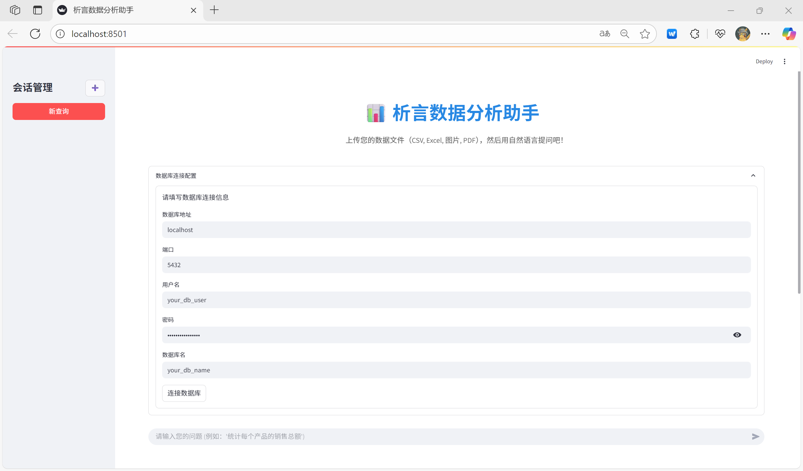
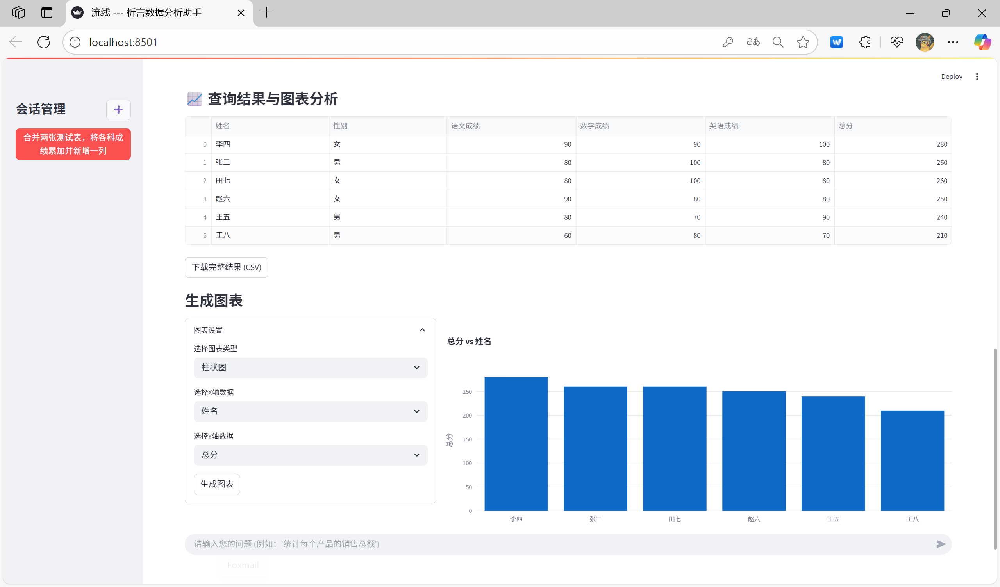

# 🎯 析言数据分析助手

<div align="center">


**🚀 基于AI的智能数据分析平台 - 支持自然语言查询、多格式文件处理和可视化分析**

[功能特性](#-功能特性) • [快速开始](#-快速开始) • [界面展示](#-界面展示) • [部署指南](#-部署指南) • [技术栈](#-技术栈)

</div>

---

## 🌟 功能特性

### 📁 多格式文件支持
- **表格文件**: CSV, Excel (.xls, .xlsx)
- **图片文件**: JPG, PNG (OCR识别)
- **文档文件**: PDF (OCR识别)
- **智能编码检测**: 自动识别文件编码格式

### 🤖 AI智能分析
- **自然语言查询**: 使用XiYan-SQL模型将自然语言转换为SQL
- **OCR表格提取**: 基于Qwen-VL模型的图片/PDF表格识别
- **智能数据清洗**: 自动处理缺失值、格式标准化

### 📊 数据可视化
- **交互式图表**: 基于Plotly的动态图表生成
- **多种图表类型**: 柱状图、折线图、饼图等
- **结果导出**: 支持CSV格式下载

### 🔧 企业级特性
- **数据库集成**: PostgreSQL数据库自动管理
- **会话管理**: 多会话支持，数据隔离
- **连接池**: 高性能数据库连接管理
- **错误处理**: 统一的错误处理和日志记录

---

## 🚀 快速开始

### 环境要求

- **Python**: 3.8+
- **数据库**: PostgreSQL 12+
- **内存**: 推荐4GB+
- **存储**: 推荐1GB+

### 一键安装

```bash
# 克隆项目
git clone https://github.com/blacksamuraiiii/xiyan-web.git
cd xiyan-web

# 创建虚拟环境
python -m venv venv
source venv/bin/activate  # Linux/macOS
# 或 venv\Scripts\activate  # Windows

# 安装依赖
pip install -r requirements.txt

# 配置环境变量
cp .env.example .env
# 编辑 .env 文件，填入你的配置信息

# 启动应用
streamlit run app.py
```

### Docker部署

```bash
# 克隆项目
git clone https://github.com/blacksamuraiiii/xiyan-web.git
cd xiyan-web/docker

# 配置环境变量
cp ../.env.example .env
# 编辑 .env 文件

# 启动服务
docker-compose up --build -d
```

访问 `http://localhost:8501` 即可使用

---

## 🎨 界面展示

### 📊 数据库连接


### 📁 文件上传


### 💬 智能分析


### 📈 可视化结果


---

## ⚙️ 部署指南

### 环境配置

创建 `.env` 文件并配置以下参数：

```env
# 视觉语言模型配置 (OCR功能)
VL_MODEL_BASEURL=YOUR_VL_MODEL_API_BASE_URL
VL_MODEL_KEY=YOUR_VL_MODEL_API_KEY
VL_MODEL_NAME=qwen-vl

# SQL生成模型配置
SQL_MODEL_BASEURL=YOUR_SQL_MODEL_API_BASE_URL
SQL_MODEL_KEY=YOUR_SQL_MODEL_API_KEY
SQL_MODEL_NAME=text2sql

# 数据库连接配置
DB_HOST=localhost
DB_PORT=5432
DB_USER=your_db_user
DB_PASSWORD=your_db_password
DB_DATABASE=your_db_name
```

### 推荐模型

#### XiYanSQL-QwenCoder-32B-2504
专为SQL生成优化的模型
- 🤗 [HuggingFace](https://huggingface.co/XGenerationLab/XiYanSQL-QwenCoder-32B-2504)
- 🎯 [魔搭](https://modelscope.cn/models/XGenerationLab/XiYanSQL-QwenCoder-32B-2504)

#### Qwen2.5-VL-7B-Instruct
强大的视觉语言模型
- 🤗 [HuggingFace](https://huggingface.co/Qwen/Qwen2.5-VL-7B-Instruct)
- 🎯 [魔搭](https://modelscope.cn/models/Qwen/Qwen2.5-VL-7B-Instruct)

---

## 🛠️ 技术栈

### 前端技术
- **Streamlit**: 现代化Web应用框架
- **Plotly**: 交互式数据可视化
- **HTML/CSS**: 界面美化

### 后端技术
- **Python**: 核心开发语言
- **Pandas**: 数据处理和分析
- **NumPy**: 数值计算
- **PostgreSQL**: 主数据库

### AI模型
- **XiYan-SQL**: 自然语言转SQL
- **Qwen-VL**: 视觉语言模型
- **OpenAI API**: 通用API接口

### 文件处理
- **PyMuPDF**: PDF文件处理
- **python-calamine**: Excel文件解析
- **chardet**: 文件编码检测
- **Pillow**: 图像处理

---

## 📋 使用说明

### 基本使用流程

1. **启动应用**: 运行 `streamlit run app.py`
2. **连接数据库**: 在侧边栏配置数据库连接
3. **上传文件**: 拖拽或点击上传数据文件
4. **自然语言查询**: 输入问题如"统计每个产品的销售总额"
5. **查看结果**: 获得表格和图表分析结果
6. **导出数据**: 下载CSV格式的分析结果

### 支持的查询类型

- **统计分析**: "计算平均值、总和、最大值等"
- **数据筛选**: "显示销售额大于1000的产品"
- **数据排序**: "按价格从高到低排序"
- **数据分组**: "按地区统计销售额"
- **数据删除**: "删除临时表数据"

---

## 🤝 贡献指南

我们欢迎所有形式的贡献！

### 开发环境设置

```bash
# 克隆项目
git clone https://github.com/blacksamuraiiii/xiyan-web.git
cd xiyan-web

# 创建开发分支
git checkout -b feature/your-feature-name

# 安装开发依赖
pip install -r requirements.txt
pip install pytest black flake8

# 运行测试
pytest tests/

# 代码格式化
black .
flake8 .
```

### 提交规范

- **功能**: `feat: 添加新功能`
- **修复**: `fix: 修复bug`
- **文档**: `docs: 更新文档`
- **样式**: `style: 代码格式化`
- **重构**: `refactor: 代码重构`
- **测试**: `test: 添加测试`

---

## 📝 更新日志

### v0.3.3 (2025-08-04)

#### 🐛 重要Bug修复
- **数据库类型转换错误**: 修复PostgreSQL无法将空字符串转换为数值/时间类型的问题
- **UTF-8日志编码**: 修复日志文件中文乱码问题，确保所有日志正确显示中文
- **空值处理增强**: 优化数据预处理逻辑，统一处理各种空值表示
- **表名验证修复**: 修复验证阶段表名不匹配的问题

#### 🔧 技术改进
- **类型推断策略**: 采用统一TEXT类型策略，避免所有类型转换错误
- **数据兼容性**: 支持包含空值的Excel文件直接导入
- **错误预防**: 增强数据验证和预处理机制
- **稳定性提升**: 彻底解决数据库导入失败问题

#### 📊 测试验证
- ✅ **50条记录**成功导入PostgreSQL
- ✅ **60个字段**无类型转换错误
- ✅ **空值**正确处理为NULL
- ✅ **UTF-8日志**正确显示中文
- ✅ **完整验证流程**通过

### v0.3.1 (2025-08-03)

#### 🎉 重大优化
- **文件解析稳定性**: 增强CSV、Excel、PDF解析的兼容性
- **UI界面美化**: 全新的现代化界面设计
- **性能优化**: 添加数据库连接池和批量插入优化
- **错误处理**: 统一的错误处理机制

#### 🔧 技术改进
- **CSV解析**: 多种编码尝试机制 (utf-8, gbk, gb2312, latin1)
- **Excel解析**: 多引擎支持 (calamine, openpyxl, xlrd)
- **OCR优化**: 内存管理和图片格式转换优化
- **数据库**: 连接池支持和事务处理优化

#### 🎨 界面优化
- **布局优化**: 响应式列布局设计
- **文件上传**: 美化的拖拽上传界面
- **数据展示**: 改进的表格和图表显示
- **用户体验**: 统一的图标和色彩主题

#### 🤖 AI优化
- **Claude Code**: 由Claude Code协助完成代码优化和重构
- **代码质量**: 遵循KISS原则，提升代码可维护性
- **错误处理**: 标准化的错误消息和用户建议

---

## 📄 许可证

本项目采用 [MIT 许可证](LICENSE) - 查看 [LICENSE](LICENSE) 文件了解详情。

---

## 🙏 致谢

### 特别感谢
- **Claude Code** - 感谢Claude Code在v0.3.1版本优化中提供的代码重构、性能优化和界面美化支持
- **XiYanSQL团队** - 提供优秀的SQL生成模型
- **Qwen团队** - 提供强大的视觉语言模型

### 技术支持
- [Streamlit](https://streamlit.io/) - 现代化Web应用框架
- [Pandas](https://pandas.pydata.org/) - 数据处理库
- [Plotly](https://plotly.com/) - 数据可视化库
- [PostgreSQL](https://www.postgresql.org/) - 关系型数据库

---

## 📞 联系我们

- **问题反馈**: [GitHub Issues](https://github.com/blacksamuraiiii/xiyan-web/issues)
- **功能建议**: [GitHub Discussions](https://github.com/blacksamuraiiii/xiyan-web/discussions)
- **邮件联系**: black_samurai@yeah.net

---

<div align="center">

**⭐ 如果这个项目对您有帮助，请给我们一个Star！**


</div>